---
lab:
    title: 'Explore Azure Active Directory'
    module: 'Module 2 Lesson 1: Describe the capabilities of Microsoft Identity and access management solutions: Explore the services and identity types of Azure AD'
---

# Lab: Explore Azure Active Directory

## Lab scenario

In this lab, you will access Azure Active Directory.  Additionally, you will create a user and configure the different settings, including adding licenses.  

**Estimated Time**: 10-15 minutes

#### Task 1:  As a subscriber to Microsoft 365 you are already using Azure AD.  In this task you will walk through accessing Azure AD through the Microsoft 365 Admin portal and through the Azure portal.

1. Open Microsoft Edge.

1. In the address bar enter **admin.microsoft.com** to access the Microsoft 365 admin center.

1. Sign in with the credentials provided in the **Enviornment Details** Tab. 
    1. In the Sign in window enter **admin@xxxxx.onmicrosoft.com** (where xxxxx is your unique tenant ID provided by your lab hosting provider) then select **Next**.
    1. Enter the admin password which should be provided by your lab hosting provider. Select **Sign in**.
    1. When prompted to stay signed- in, select **Yes**.

   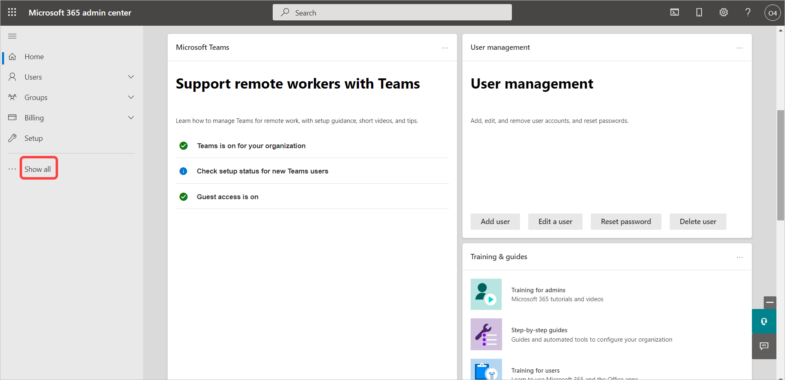

1. From the left navigation pane of the Microsoft 365 admin center, select **Show all**.

1. Under Admin centers, select **Azure Active Directory** (you may need to scroll down).  

   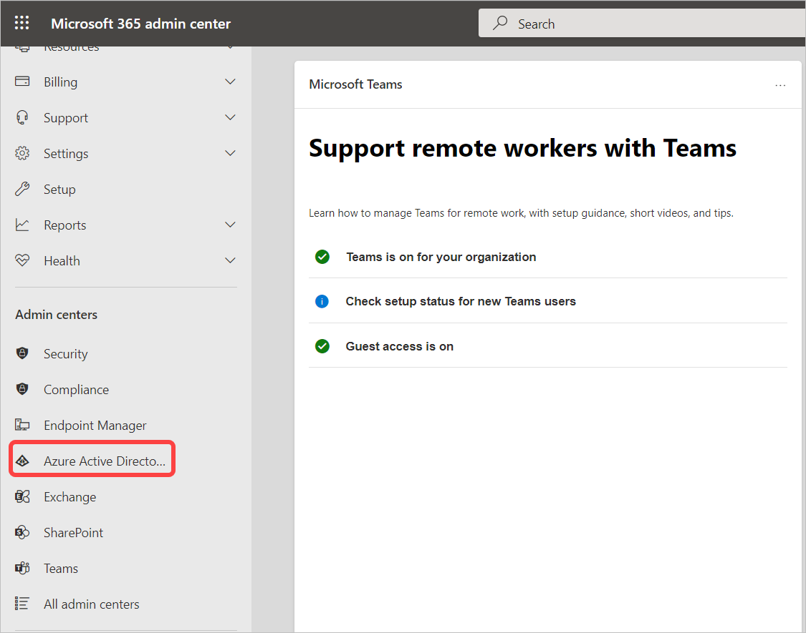

1. A new browser page opens to the My Dashboard page of the Azure Active Directory admin center. From the dashboard’s main windows, you will see several tiles, including the Organization’ Identity tile ( the tenant and the Azure AD edition), a tile for users and groups, and more.

   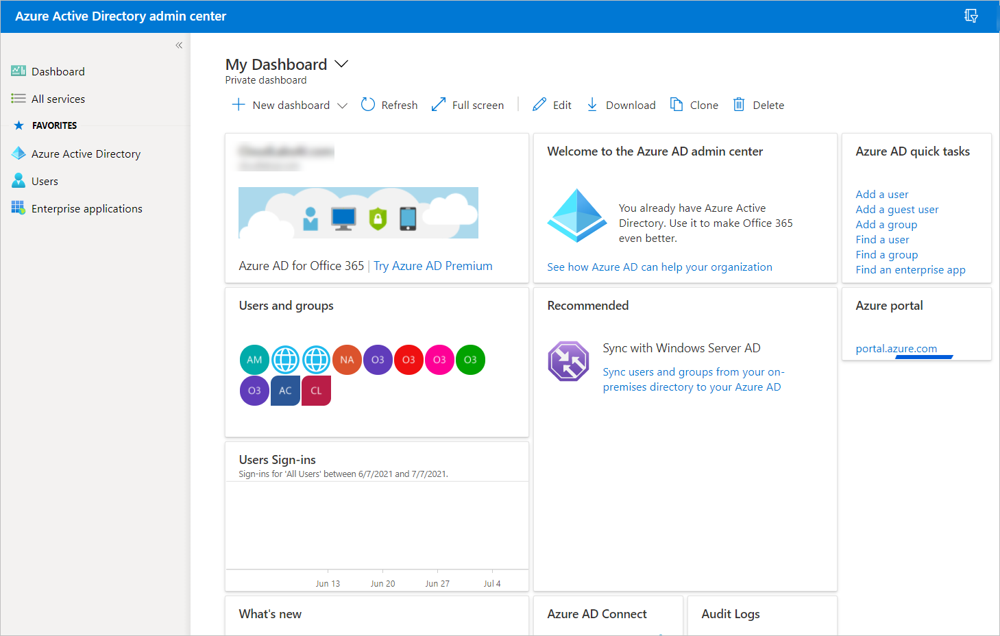

1. From the left navigation pane, under favorites select **Azure Active Directory**.  In the main window you will see another navigation panel which lists all the services that are available in Azure AD. To the right, you will see information about the tenant and links to identity types you can create and featured services.  

   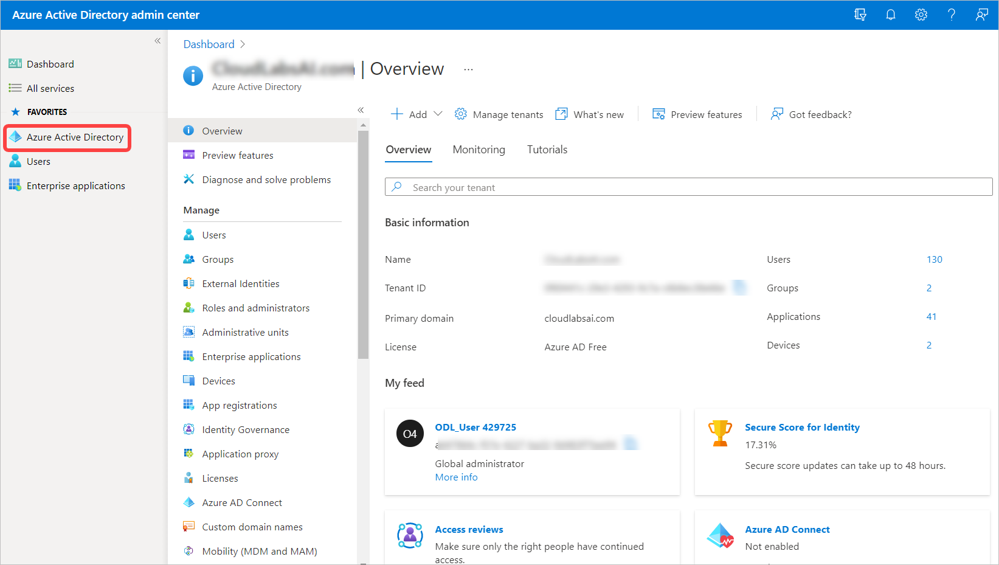

1. Now open a new browser window and in the address bar, enter **portal.azure.com**.  Since you are already signed in as admin@xxxxx.onmicrosoft.com and you originally used those same credentials to redeem your Azure pass, you should be logged in as admin when you access the Azure portal.  You can verify this by checking the email on the top-right corner of the page and hovering your mouse over the user icon.

   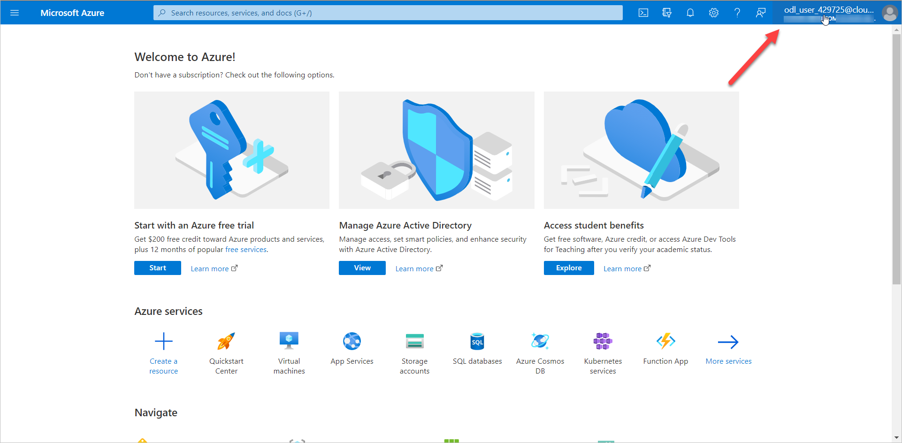

1. The Azure portal’s landing page shows Azure services, including Azure Active Directory, VMs, storage accounts, databases, and much more.  Click on **View** below the **Manage Azure Active Directory**.

   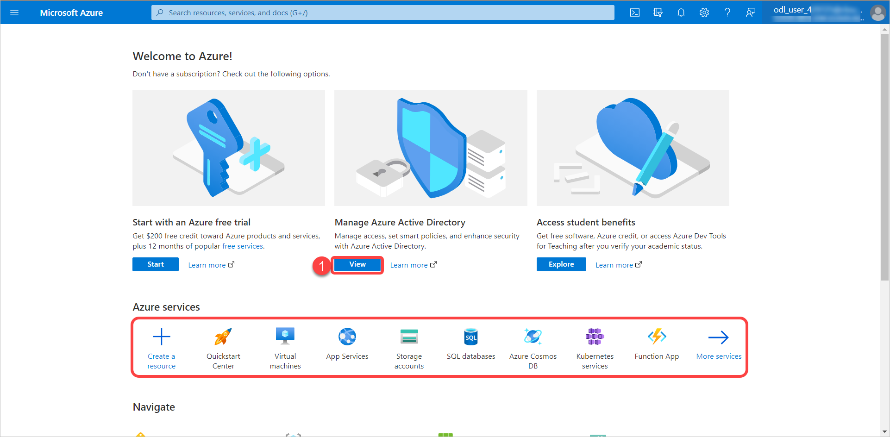

1. You are now seeing the Azure Active Directory for your Microsoft 365 tenant. Whichever approach you use to access Azure Active Directory services (the Microsoft 365 admin portal or the Azure portal) you end up in the same place – the Azure Active Directory where you can administer all the Azure AD services.

   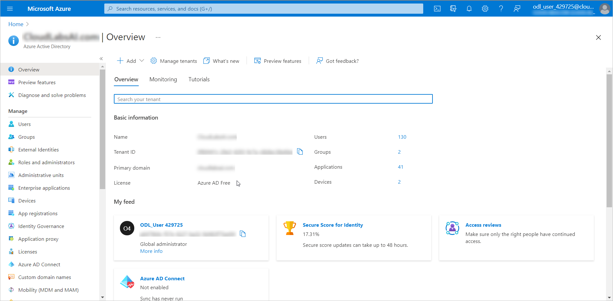

#### Task 2: Creating a basic group

1. On the Active Directory page, select Groups and then select New group.

   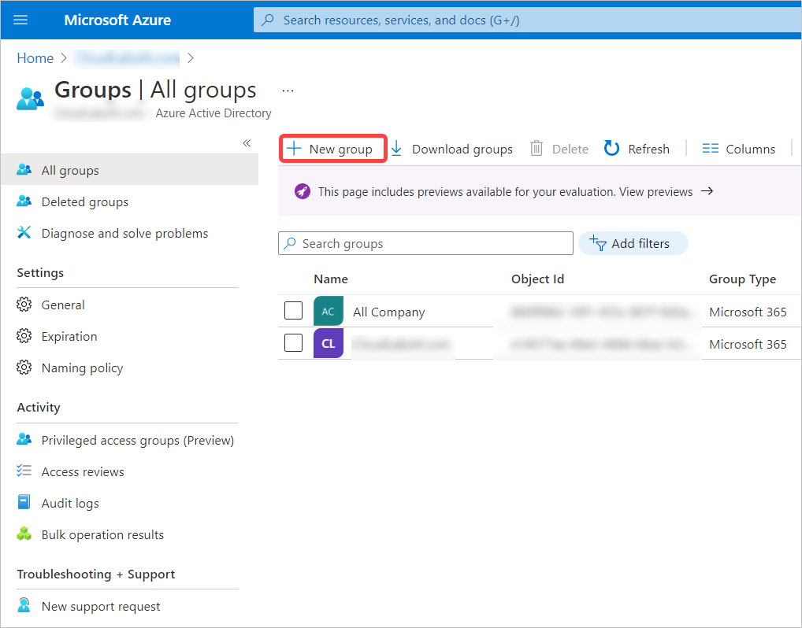

1. Populate the **New Group** fields as follows and Select Create

    1. Group type: **Microsoft 365**.

    2. Group name: **Operations**.

    3. Group email address: **Leave Default**.

    4. Group description: **Add an optional description to your group**.

   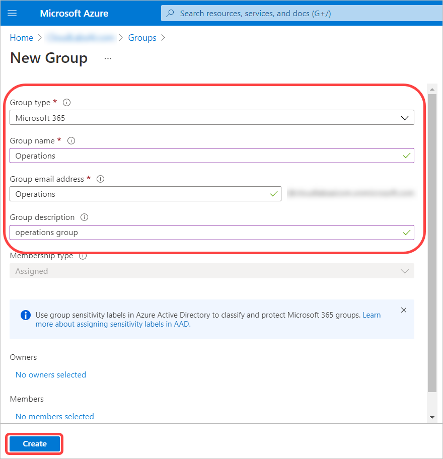
   

#### Task 3:  In this task, you’ll learn how to create a new user in Azure Active Directory and explore some of services that can be managed at the user level.

1. In Azure Active Directory Overview page, Click on the **Users** blade under the manage section

   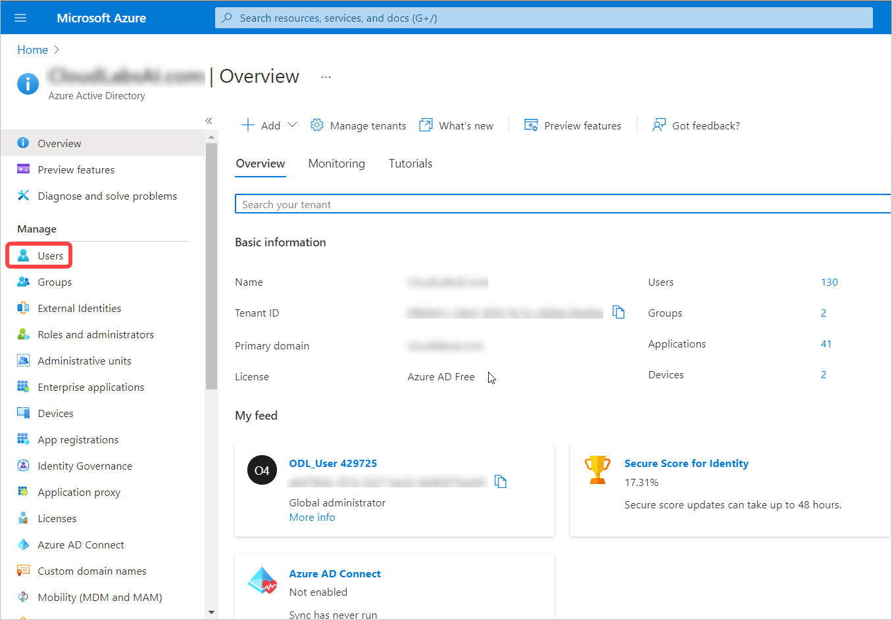

2. From the left navigation pane, select **Users**. Notice that your tenant is already configured with users. Select **+ New user** on the top of the page.

   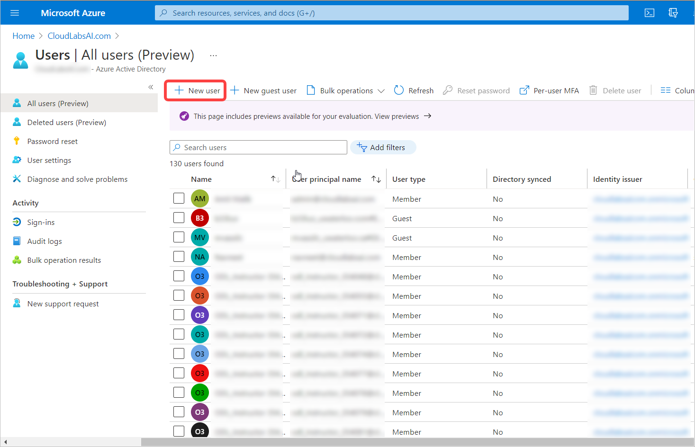

4. **Create User** should already be selected, if not select that option.

5. Populate the **Identity** fields as follows:

    1. User name: **sara**.

    2. Name field: **Sara Perez**.

    3. First name: **Sara**.

    4. Last name: **Perez**.

   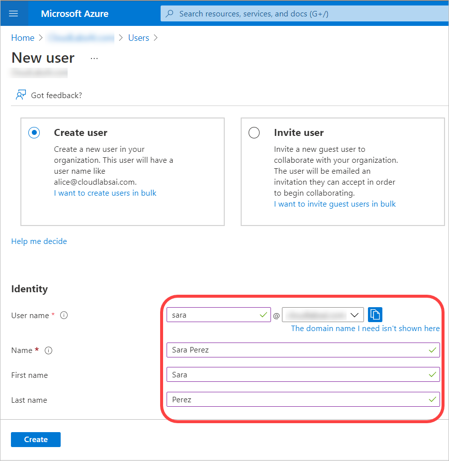

6. Populate the **Password** fields as follows:

    1. Select **Let me create the password**.

    1. Initial password: **Naja8996**. When Sara signs-in for the first time, she will be prompted to change her password.

   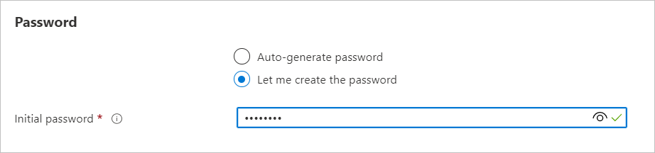

7. Configure **Groups and roles**.

    1. Next to Groups, select **0 groups selected**.  This displays the available groups.  Notice the list of available groups.

    2. Select **Operations**, you may need to scroll down, then press **Select**. Notice how the text next to groups has been updated to reflect 1 groups selected.  

   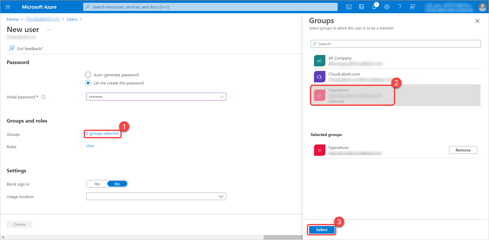

    3. Next to Roles, select **User**. The list of Directory roles appears.  Scroll down to view the various built-in roles, to view the various roles, but don’t change the user role.  Close out of this window by select the **X** on the top right-hand corner of the page.

   

8. Configure **Settings**

    1. Block sign in:  **No** (leave the default setting).

    1. Usage location: **United States** (select the drop-down then scroll down to find this option).  Configuring usage location is required for assigning licenses.

   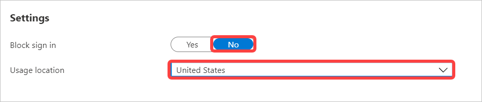

9. From the bottom of the page, select the **Create** button.

   

10. Verify the user appears on the user list (names are listed in alphabetical order).

11. From the user list select the user you just created, **Sara Perez**.  The profile page opens.

  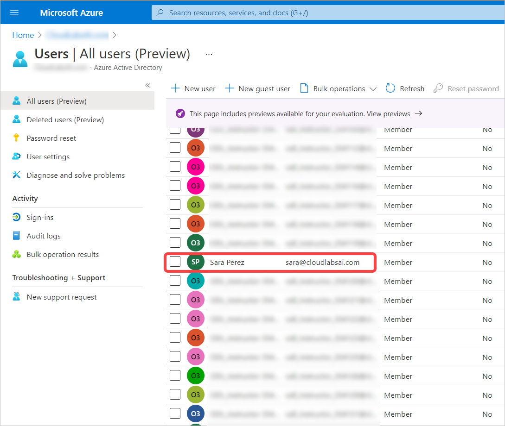

12. The left navigation panel shows the various options that can be configured for the user.  Select **Groups**.  Here you can see additional information about the group.  Verify the Operations group is listed (it may take several minutes for the group assignment to show up).  Note:  you will also see the another group, although we only assigned one group when we created the user.  This is a result of a preconfigured policy, in the tenant, that automatically assigns new users to the group.

  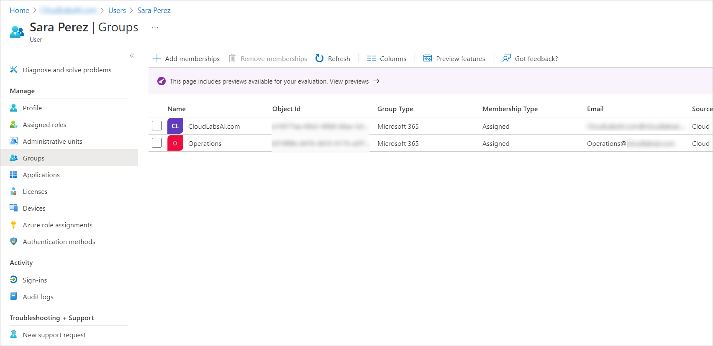

13. From the left navigation panel select **Licenses**.  Notice that there are no license assignments found for this user.  

14. To add a license select **+ Assignments** from the top of the main window.

  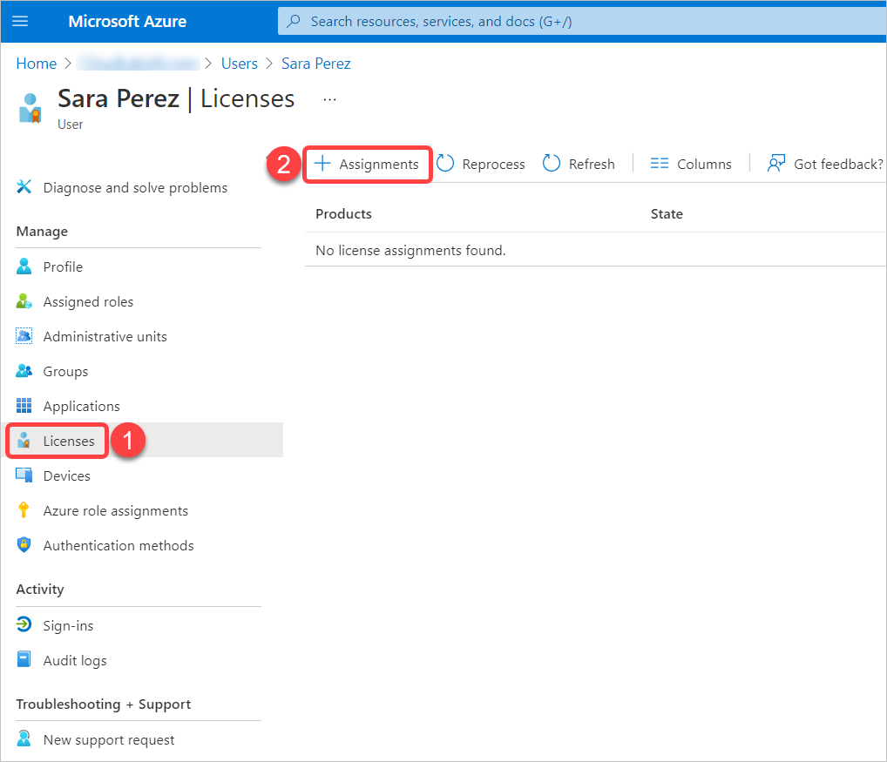

15. Under Select licenses, select **Office 365 E3** then select the **Save** button on the bottom of the screen. A notification on the top right corner of the screen should show that license assignments succeeded.

  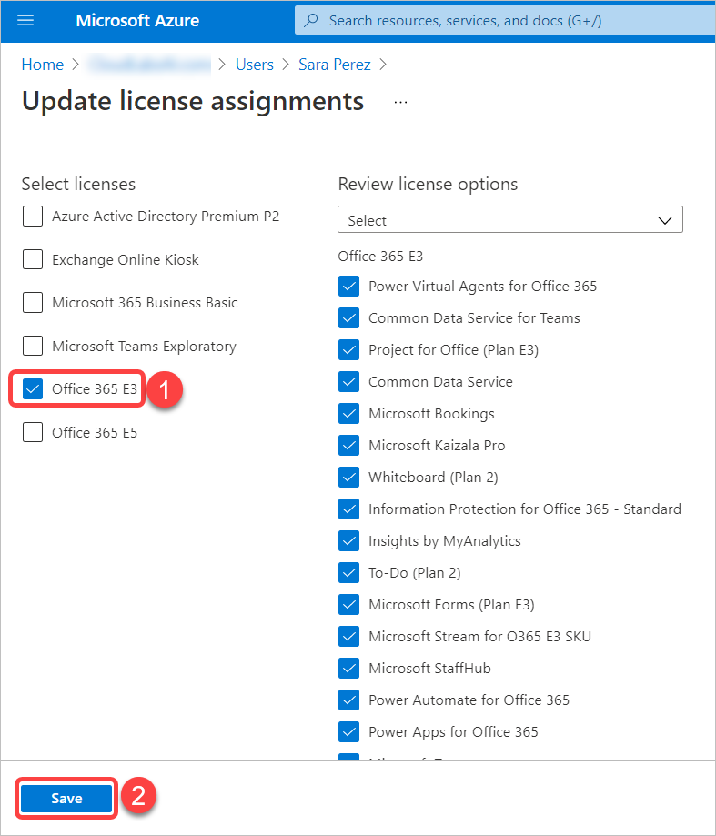

16. Select the **X** on the top right of the screen to close the License assignments window.

17. Select the **Refresh icon** at the top of the page to confirm the license assignments.

18. Return to the Azure Active Directory Overview page

19. You have successfully created and configured a user in Azure Active Directory.

20.	Sign out from all the browser tabs by clicking on the user icon next to the email address on the top right corner of the screen. Then the close all the browser windows.

#### Task 4:  In this task, you will sign in as Sara Perez, for the first time.

1. Open Microsoft Edge.

2. In the address bar enter **login.microsoft.com**.

3. Sign in as **sara@xxxxx.onmicrosoft.com**, (where xxxxx is your unique tenant ID provided by your lab hosting provider).

4. Enter the temporary password **Naja8996**.

  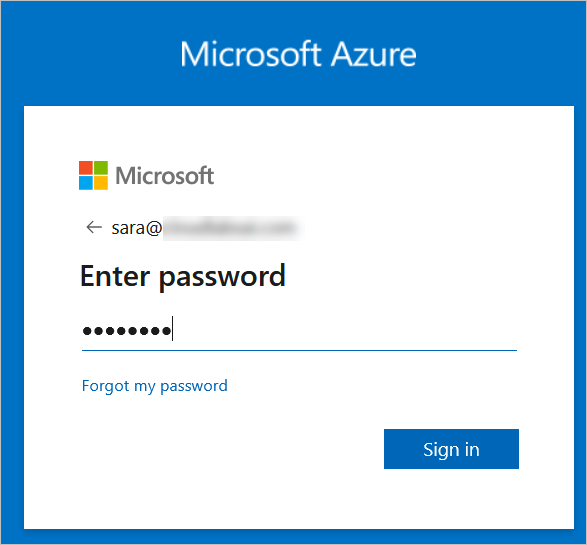

5. You are now prompted to Update your password. In the Current password field, enter **Naja8996**.

6. In the New password field enter, **SC900-Lab**.  In the Confirm your password field enter SC900-Lab, then select Sign in.  Note: As a best practice, a more secure password should be used. This password is chosen, for expediency and only for the purpose of this lab.

  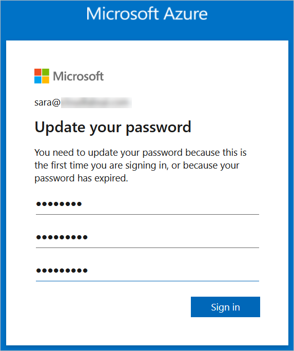

7. You should now be successfully signed-in to Microsoft 365.

  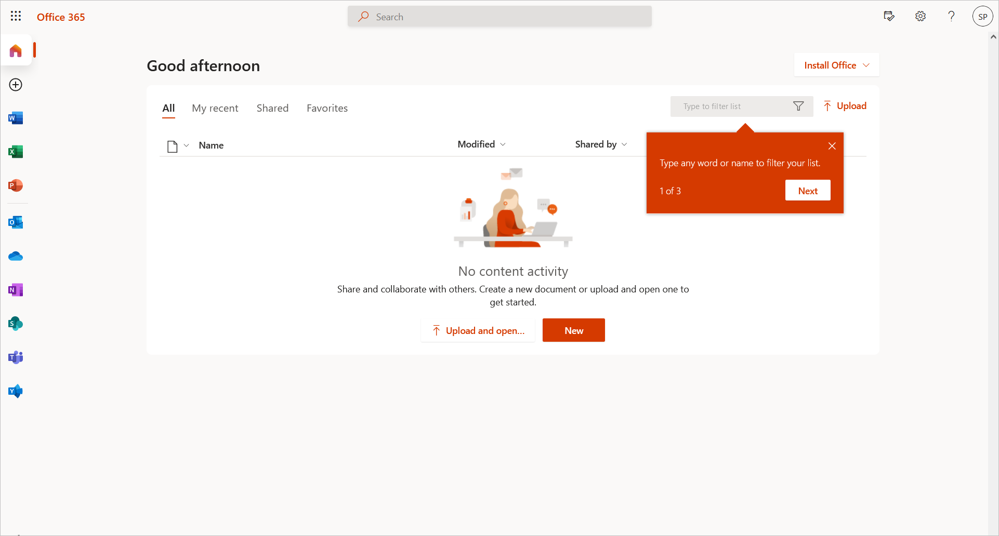

8. **Sign out** from all the browser tabs by clicking on the user icon next to the email address on the top right corner of the screen. Then the close all the browser windows.

#### Review
In this lab, you started your initial exploration of Azure AD. Since subscribers to Microsoft 365 are automatically using Azure AD, you found that you access Azure AD features and services through either the Microsoft 365 admin portal or through the Azure portal.  Whichever approach you prefer to get to the same place.  You also walked through the process of creating a new user and the different setting that can be configured, including groups to which the user can be assigned, the availability of roles, and assigning of user licenses..